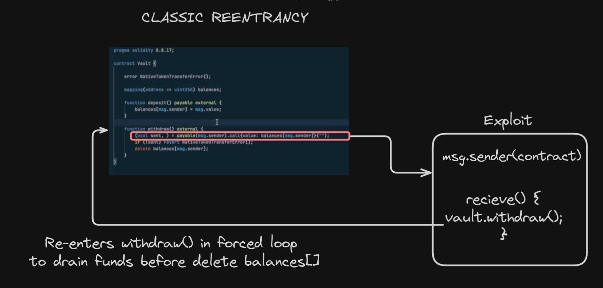
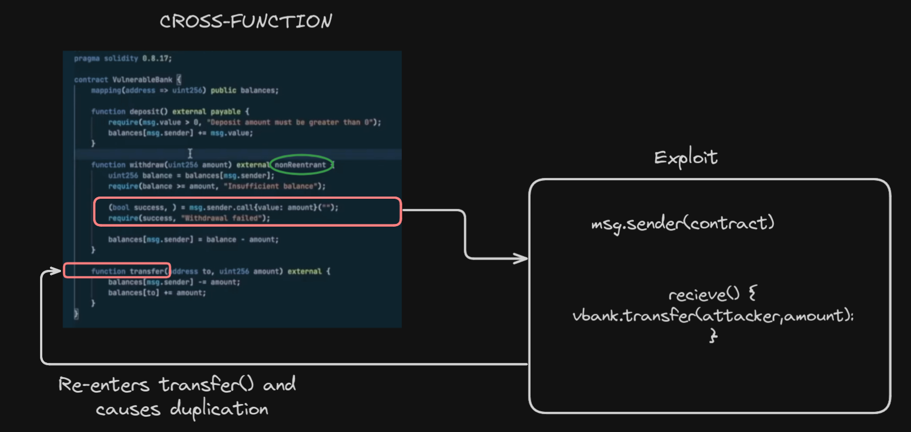
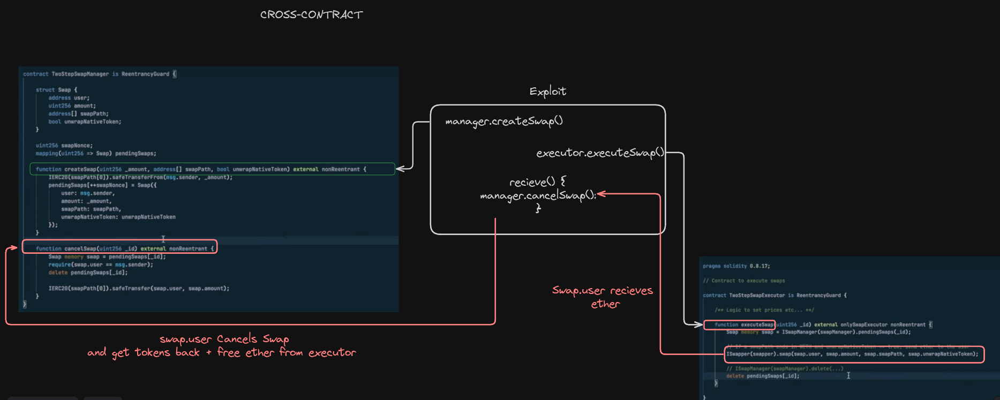

#Description: Reentrancy Notes

# Reentrancy

## Cases

### Classic Case

CEI (Checks -> Effects -> Interactions) not followed, state not updated before external calls Eg. attacker can drain eth via recieve.

### Cross-Function

If A function is vulnerable but also has nonreentrant modifier it can be exploited by reentering into another function which controls same data to take advantage of it's outdated state.

### Cross-Contract

Even If all functions of all contracts in a protocol use nonreentrant modifier, That modifier is only valid within the storage of that purticular contract in which the function exists and thus interplay between contracts can still be exploited for re-entrancy.

### Read-Only

Not following CEI in a function can lead to outdated state which can cause problems. Eg view function shows more balance available for an attacker than is actually withdrawable which can cause loss of funds.

### ERC721 && ERC777

OnERC721Recieved() called on `to` address & erc777 callbacks can be a possible vector to reentrancy.

## How to find

ROOT CAUSE ==> Not following CEI + arbitrary External Call.

1. Enumerate all external calls made by system.
   - to arbitrary addresses
   - especially made before state updates
2. Collect list of knobs (gadgets)
   - Every piece of state that is outdated for every risky external call made
3. Enumerate all possible Re-entry points in the system for each external call found in previous steps.
   - think about what will be the advantage of re-entering this function
