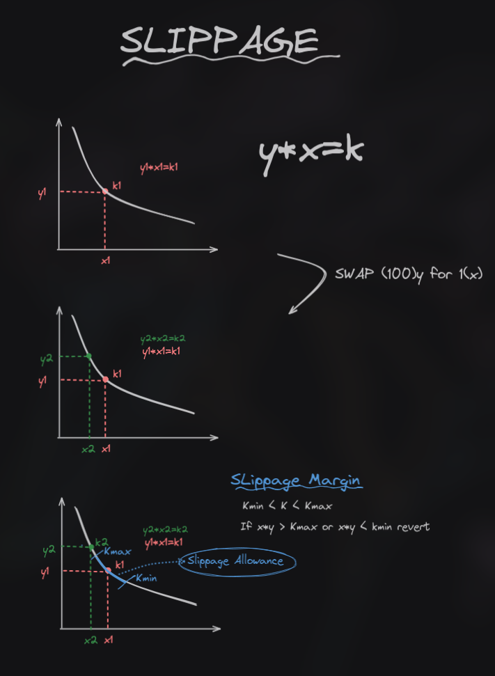

#Description: Sandwich attacks

# Sandwich attacks

Special case of fruntrunning particularly done for profits.

## slippage

Slippage is movement of price of an asset. In uniswap with `y*x=k` price can be forced to move by executing swaps. this can be exploited with sandwich attacks to force users into buying assets at high or selling at low.

**Slippage protection** is used to protect against such attacks. Price movrmrnts can be limited and Tx revert if swap makes price move outside of a certain acceptable margin. 
Allways set slippage when performing a swap.

## How to Find

- If protocol interacts with AMM or executes swaps Look for slippage threshold
- think a bout slippage protection
- look at all swap calls to figure out slippage configuration
- If looking at AMMs look for if protocol provides optimal slippage control to users
